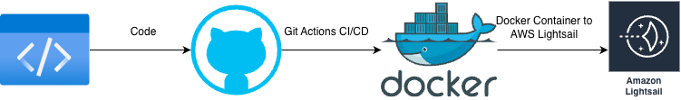

# Automated Cloud-Native Deployment Pipeline with AWS Lightsail & GitHub Actions 🚀

[English](#english) | [Turkish](#turkish)

---

<a name="turkish"></a>
## 🇹🇷 Türkçe Proje Tanımı

### 📌 Problem Tanımı
Yazılım güncellemelerinin manuel olarak sunucuya yüklenmesi hem zaman alıcıdır hem de insan hatasına (yanlış konfigürasyon, eksik dosya vb.) oldukça açıktır. Bu durum, canlı ortamda kesintilere ve verimlilik kaybına yol açar.

### ✅ Çözüm
Bu projede, manuel süreçleri ortadan kaldıran tam otomatize bir CI/CD pipeline kurgulanmıştır. **Docker** ve **GitHub Actions** kullanılarak, her kod değişikliğinde otomatik olarak imaj build alan ve **AWS Lightsail** üzerine kesintisiz dağıtım yapan bir yapı oluşturulmuştur.

### 🛠 Teknoloji Yığını (Tech Stack)
- **Backend:** Python (Flask)
- **Containerization:** Docker
- **CI/CD:** GitHub Actions
- **Cloud:** AWS Lightsail Container Service
- **Config:** JSON-based Deployment Spec

### 🌟 Öne Çıkan Özellikler
- **Least Privilege (En Az Yetki):** AWS IAM rolleri, güvenliği maksimize etmek adına sadece ilgili görevi yapacak kadar yetkiyle (En Az Yetki prensibi) yapılandırılmıştır.
- **Health Checks:** Dağıtım sırasında uygulamanın sağlığı kontrol edilir; eğer yeni sürüm hatalıysa AWS eski çalışan sürümü korumaya devam eder.
- **Automated Workflow:** Kodun canlıya geçmesi için tek bir `git push` yeterlidir.

---

<a name="english"></a>
## 🇺🇸 English Project Description

### 📌 Problem Statement
Manually uploading software updates to a server is time-consuming and highly prone to human error (misconfiguration, missing files, etc.). This leads to downtime in production environments and a significant loss in productivity.

### ✅ Solution
In this project, a fully automated CI/CD pipeline was designed to eliminate manual processes. Using **Docker** and **GitHub Actions**, a structure was created that automatically builds images on every code change and performs **Zero-Downtime** deployment to **AWS Lightsail**.

### 🛠 Tech Stack
- **Backend:** Python (Flask)
- **Containerization:** Docker
- **CI/CD:** GitHub Actions
- **Cloud:** AWS Lightsail Container Service
- **Config:** JSON-based Deployment Spec

### 🌟 Key Features
- **Least Privilege Principle:** AWS IAM roles are configured with the minimum permissions necessary (Least Privilege) to perform their specific tasks, maximizing security.
- **Health Checks:** The application's health is monitored during deployment; if the new version is faulty, AWS maintains the previous working version.
- **Automated Workflow:** A single `git push` is all it takes to go live.

---

## 🏗 Architecture / Mimari


---

## 🚀 How to Run / Nasıl Çalıştırılır?

1. **Clone the repo:**
   ```bash
   git clone <your-repo-url>
   
2. **Local Test (Docker):**
   ```bash
   docker-compose up --build
